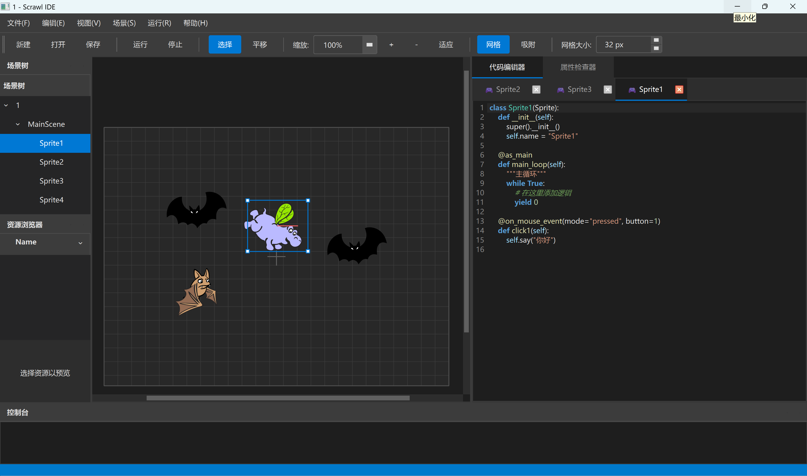
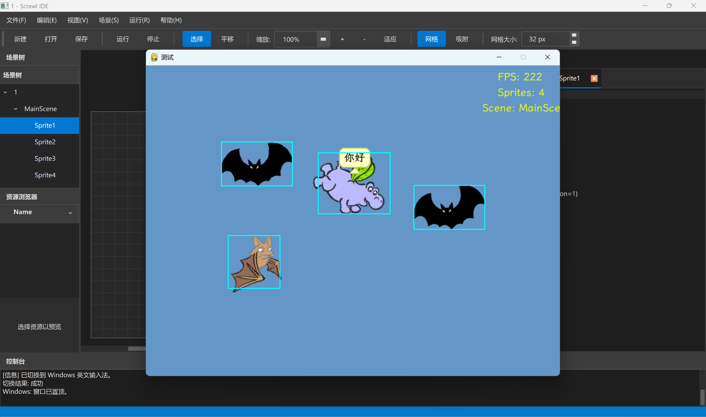

# Scrawl - 类 Scratch 的 Python 游戏引擎

中文 | [English](README_en.md)

<p align="center">
  
</p>

# 热烈邀请大家到QQ群：1001578435交流！！！ 

<p align="center">
  <a href="#">
    
  </a>
</p>

---

## ✨ 交互式可视化 IDE

Scrawl 提供了一个**类 Godot 的可视化 IDE**，让游戏开发更加直观便捷！

- 🎨 **可视化场景编辑器** - 拖拽精灵、实时预览
- 📝 **内置代码编辑器** - 语法高亮、即时编辑
- 🎮 **一键运行** - 直接在 IDE 中测试游戏
- 🔧 **属性检查器** - 可视化调整精灵和场景属性
- 🤖 **AI 编程助手** - 配置 API Key 后，AI 可以帮你编写和修改游戏代码！

<p align="center">
  
  
</p>

### 🤖 AI 助手功能（新功能！）

> ⚠️ **注意：Scrawl IDE 目前处于初步开发阶段**，功能持续完善中，欢迎反馈建议！

#### 🎁 免费 AI API 试玩

为感谢大家的支持，我们为大家提供了**免费的 AI API**，无需自行配置即可体验 AI 编程助手！

- 🆓 **开箱即用** - 默认选择免费模型，无需配置 API Key
- 🤖 **多模型可选** - 提供 Gemini、GLM、Kimi、MiniMax 等多种免费模型
- ⏱️ **每日限额** - 每个模型每日 500 次调用（所有用户共享）
- ⚙️ **支持自定义** - 也可在设置中配置自己的 OpenAI 兼容 API

#### 功能特性

- 💬 **智能对话** - 用自然语言描述需求，AI 自动生成代码
- ✏️ **代码修改** - AI 可以直接修改精灵和场景的代码
- 🎛️ **属性调整** - AI 可以修改精灵位置、大小等属性
- 📋 **一键应用** - 点击"应用"按钮即可将 AI 生成的代码更新到项目中

第一次AI对话：

https://github.com/user-attachments/assets/f58c2f57-b0d3-4aa7-a38b-742ec3046761

四次AI对话后成品：

https://github.com/user-attachments/assets/9d1c0071-3832-4b30-aa36-729c271c6749

---

## 简介

Scrawl 是一个基于 Pygame 的类 Scratch 游戏引擎，旨在为开发者提供类似 Scratch 的直观编程体验，同时利用 Python 的强大功能。

## 最佳示例

女巫游戏: https://github.com/streetartist/scrawl_demo_witch

## 核心特性

-   🧩 **类 Scratch 开发范式**: 使用装饰器标记主协程、克隆协程和事件处理协程
-   🎮 **内置游戏对象系统**: 开箱即用的精灵、场景、粒子系统等
-   ⚙️ **物理引擎集成**: 支持速度、重力、弹性等物理属性
-   📻 **广播消息系统**: 组件间通信机制
-   🔧 **调试工具**: 实时显示 FPS、精灵数量等调试信息
-   🎨 **绘图工具**: 支持画笔绘制
-   🚀 **协程任务系统**: 协程机制支持直观的 `while True` 循环

## 快速开始

### 1. 安装 Scrawl 引擎

```bash
pip install scrawl-engine
```

升级到最新版本：

```bash
pip install --upgrade scrawl-engine
```

### 2. 使用可视化 IDE（推荐）

克隆代码库：

```bash
git clone https://github.com/streetartist/scrawl
cd scrawl
```

安装 IDE 依赖：

```bash
pip install -r scrawl_ide/requirements.txt
```

运行 IDE：

```bash
python scrawl_ide/main.py
```

即可启动可视化 IDE，通过拖拽和 AI 助手快速创建游戏！

### 3. 代码示例

以下代码演示了 Scrawl 的基本用法：

**示例 1：**

```python
from scrawl import *
import pygame

# svg files from https://scratch.mit.edu/projects/239626199/editor/

# 创建游戏实例
game = Game()

class Bat(Sprite):
    def __init__(self):
        super().__init__()
        self.name = "Bat"
        self.add_costume("costume1", pygame.image.load("bat2-b.svg").convert_alpha())
        self.add_costume("costume2", pygame.image.load("bat2-a.svg").convert_alpha())
        self.visible = False
        self.set_size(0.5)

    @as_clones
    def clones1(self):
        self.pos = pygame.Vector2(400, 300)
        self.face_random_direction()
        self.move(400)
        self.face_towards("Witch")
        self.visible = True
        while True:
            self.next_costume()
            yield 300

    @as_clones
    def clones2(self):
        while True:
            self.move(5)
            yield 200

    @as_main
    def main1(self):
        while True:
            yield 3000
            # 添加蝙蝠
            self.clone()

    @on_edge_collision()
    def finish(self):
        self.delete_self()

    @on_sprite_collision("FireBall")
    def hit_fireball(self, other):
        self.delete_self()

    @on_sprite_collision("Witch")
    def hit_witch(self, other):
        self.delete_self()

class FireBall(Sprite):
    def __init__(self):
        super().__init__()
        self.name = "FireBall"
        self.add_costume("costume1", pygame.image.load("ball-a.svg").convert_alpha())
        self.visible = False
        self.set_size(0.2)

    @as_clones
    def clones1(self):
        self.visible = True
        while True:
            self.move(10)
            yield 100

    @on_edge_collision()
    def finish(self):
        self.delete_self()

class Witch(Sprite):
    def __init__(self):
        super().__init__()
        self.name = "Witch"
        self.add_costume("costume1", pygame.image.load("witch.svg").convert_alpha())
        self.fireball = FireBall()

    @on_key(pygame.K_s, "held")
    def right_held(self):
        self.turn_right(2)

    @on_key(pygame.K_d, "held")
    def left_held(self):
        self.turn_left(2)

    @on_key(pygame.K_SPACE, "held")
    def space_pressed(self):
        self.fireball.direction = self.direction
        self.clone(self.fireball)

# 定义场景
class MyScene(Scene):
    def __init__(self):
        super().__init__()
        bat = Bat()
        self.add_sprite(bat)
        witch = Witch()
        self.add_sprite(witch)

# 运行游戏
game.set_scene(MyScene())
game.run(fps=60)
```

https://github.com/user-attachments/assets/7398ac8f-689e-4088-9d78-414272c99438

**示例 2：**

```python
from scrawl import Game, Scene, Sprite, Cat, as_main

# 创建游戏实例
game = Game()

class MyCat(Cat):
    def __init__(self):
        super().__init__()

    @as_main
    def main1(self):
        while True:
            self.walk()
            yield 500

# 定义场景
class MyScene(Scene):
    def __init__(self):
        super().__init__()
        # 添加精灵
        cat = MyCat()
        self.add_sprite(cat)

# 运行游戏
game.set_scene(MyScene())
game.run()
```


**示例 3：**

```python
from scrawl import *
import time

# 创建游戏实例
game = Game()

class Ball(Sprite):
    def __init__(self):
        super().__init__()

    @as_main
    def main1(self):
        while True:
            self.turn_left(10)
            self.move(10)
            yield 100
            self.clone()

    @as_clones
    def clones1(self):
        while True:
            self.turn_right(10)
            self.move(100)
            self.change_color_random()
            yield 1000

    @on_broadcast("event")
    def event1(self):
        self.say("hello")

# 定义场景
class MyScene(Scene):
    def __init__(self):
        super().__init__()
        # 添加精灵
        ball = Ball()
        self.add_sprite(ball)

    @as_main
    def main1(self):
        while True:
            # 添加粒子系统
            explosion = ParticleSystem(400, 300)
            self.add_particles(explosion)
            self.broadcast("event")
            yield 3000

# 运行游戏
game.set_scene(MyScene())
game.run()
```

https://github.com/user-attachments/assets/ef1a03d8-28b6-4bff-acf7-5f96be02f35a

## 核心概念

### 1. 游戏主循环（`Game` 类）
-   处理事件循环
-   管理场景切换
-   控制帧率和调试信息

### 2. 场景（`Scene` 类）
-   作为游戏容器
-   管理精灵和粒子系统
-   处理全局事件和广播消息

### 3. 精灵（`Sprite` 和 `PhysicsSprite` 类）
-   基本游戏实体
-   支持位置、方向、大小等属性
-   物理精灵支持速度、重力等物理属性

#### 常用方法：
-   `move()`, `goto()`, `turn_left()`, `turn_right()`
-   `say()`, `clone()`, `delete_self()`
-   `apply_impulse()`, `set_gravity()`（物理精灵）

### 4. 事件系统
-   **广播机制**: 组件间通信
-   **按键绑定**: 全局和场景级别绑定
-   **精灵事件**: 支持碰撞检测

## 开发文档

### 目录

- 核心概念
  - Game 类
  - Scene 类
  - Sprite 类
- 事件处理
  - 按键事件
  - 碰撞检测
  - 广播事件
- 精灵克隆
  - 创建克隆
  - 克隆行为
- 资源管理
  - 添加图片
  - 使用字体
- 高级功能
  - 物理精灵
  - 粒子系统
  - 画笔效果
- 调试工具
  - 调试模式
  - 性能监控

---

### 核心概念

#### Game 类
游戏主控制器，负责初始化和运行游戏循环：
```python
game = Game(
    width=800,
    height=600,
    title="游戏标题",
    font_path="font.ttf",
    font_size=20,
    fullscreen=False
)
game.set_scene(MyScene()) # 设置场景
game.run(fps=60, debug=True)
```

#### Scene 类
游戏场景容器，管理精灵和粒子系统：
```python
class MyScene(Scene):
    def __init__(self):
        super().__init__()
        # 添加精灵
        self.add_sprite(MySprite())

    @as_main
    def main1():
        pass # 场景主函数
# 设置场景
game.set_scene(MyScene())
```

#### Sprite 类
游戏中的基本元素，具有位置、方向、大小等属性：
```python
class MySprite(Sprite):
    def __init__(self):
        super().__init__()
        self.name = "精灵名称"
        self.pos = pygame.Vector2(100, 100)
        self.direction = 90  # 0=右, 90=上
        self.size = 1.0
        self.visible = True

    @as_main
    def main1(self):
        while True:
            # 精灵主函数
            self.move(5)
            yield 2000 # 延迟 2000ms
```

---

### 事件处理

#### 按键事件
使用装饰器处理按键事件：
```python
@on_key(pygame.K_SPACE, "pressed")  # 按下时触发
def space_pressed(self):
    print("空格键被按下")

@on_key(pygame.K_LEFT, "held")  # 按住时持续触发
def left_held(self):
    self.turn_left(2)
```

#### 鼠标事件
处理鼠标点击事件：
```python
@on_mouse("clicked", 1)  # 鼠标左键点击
def on_click(self):
    print("鼠标点击")

@on_sprite_clicked  # 精灵被点击时触发
def on_self_clicked(self):
    self.say("你点击了我！")
```

#### 碰撞检测
处理精灵之间和边界的碰撞：
```python
# 设置碰撞类型（rect/circle/mask）
self.set_collision_type("circle")

# 检测是否与其他精灵碰撞
if self.is_colliding_with(other_sprite):
    print("碰撞了！")

# 检测是否触碰指定颜色
if self.is_touching_color((255, 0, 0)):
    print("碰到红色了！")

# 边缘碰撞检测（装饰器）
@on_edge_collision("left")  # 可选：left/right/top/bottom/any
def hit_left(self):
    self.say("碰到左墙")

# 精灵碰撞检测（装饰器）
@on_sprite_collision("Enemy")  # 与名为 "Enemy" 的精灵碰撞
def hit_enemy(self, other):
    self.delete_self()
```

#### 广播事件
精灵和场景之间的通信机制：
```python
# 广播事件
self.broadcast("gameover")

# 处理广播事件
@on_broadcast("gameover")
def on_gameover(self):
    self.visible = True
```

---

### 精灵克隆

#### 创建克隆
克隆现有精灵：
```python
# 克隆自身
self.clone()

# 克隆其他精灵
self.clone(other_sprite)
```

#### 克隆行为
定义克隆体特有的逻辑：
```python
class Bat(Sprite):
    @as_clones  # 标记为克隆任务
    def clones_behavior(self):
        self.visible = True
        while True:
            self.move(5)
            yield 200  # 每 200ms 移动一次
```

---

### 资源管理

#### 添加图片
为精灵添加多个造型：
```python
self.add_costume("costume1", pygame.image.load("cat1.svg"))
self.add_costume("costume2", pygame.image.load("cat2.svg"))
self.switch_costume("costume1")  # 切换造型
self.next_costume()  # 切换到下一个造型
```

#### 使用字体
游戏字体设置：
```python
game = Game(
    font_path="Simhei.ttf",  # 支持中文字体
    font_size=20
)
```

---

### 高级功能

#### 物理精灵
具有物理属性（速度、重力、摩擦力）的精灵：
```python
class PhysicsBall(PhysicsSprite):
    def __init__(self):
        super().__init__()
        self.velocity = pygame.Vector2(0, 5)
        self.gravity = pygame.Vector2(0, 0.2)
        self.elasticity = 0.8  # 弹性系数
        self.friction = 0.02   # 摩擦力

    @as_main
    def main(self):
        # 设置物理属性
        self.set_gravity(0, 0.5)
        self.set_elasticity(0.9)
        self.set_friction(0.1)

        while True:
            # 施加力
            self.apply_force(1, 0)
            # 施加冲量
            self.apply_impulse(0, -10)
            yield 0
```

#### 粒子系统
创建粒子效果：
```python
# 在指定位置创建粒子系统
self.scene.add_particles(
    ParticleSystem(
        x=100,
        y=100,
        count=50,
        life_range=(500, 1500)
    )
)
```

#### 画笔效果
实现绘图功能：
```python
# 启用画笔
self.put_pen_down()
self.set_pen_color((255, 0, 0))
self.set_pen_size(3)

# 移动时自动记录路径
self.move(100)

# 抬起画笔
self.put_pen_up()

# 清除画笔轨迹
self.clear_pen()
```

#### 声音系统
播放音效和背景音乐：
```python
# 在场景中加载音效和音乐
self.game.load_sound("jump", "sounds/jump.ogg")
self.game.load_music("bgm", "sounds/background.mp3")

# 播放音效
self.play_sound("jump")

# 播放背景音乐（循环）
self.play_music("bgm", loops=-1)

# 播放音符（C4-C5）
self.play_note("C4", 500)

# 播放鼓声（bass/snare/hihat/cymbal）
self.play_drum("snare", 100)

# 停止音乐
self.stop_music()
```

#### 云变量
支持多人游戏的云变量同步：
```python
from scrawl import CloudVariablesClient

# 方式1：自动注册新项目（获取新的project_id）
cloud = CloudVariablesClient()
print(f"项目ID: {cloud.project_id}")  # 保存此ID以便下次使用

# 方式2：使用已有的项目ID
cloud = CloudVariablesClient(project_id="your-project-uuid")

# 设置变量
cloud.set_variable("score", 100)

# 获取变量
score = cloud.get_variable("score", default=0)

# 获取所有变量
all_vars = cloud.get_all_variables()

# 关闭连接
cloud.close()
```

> 注意：首次使用会自动注册项目并返回project_id，请保存此ID以便后续使用同一项目。

---

### 调试工具

#### 调试模式
启用调试信息显示：
```python
game.run(debug=True)  # 启用调试模式

# 记录调试信息
game.log_debug("精灵已创建")
```

#### 性能监控
屏幕上显示的关键性能指标：
1. 实时 FPS
2. 场景中精灵数量
3. 当前场景名称
4. 自定义调试信息

## 贡献指南

欢迎通过 GitHub 提交 issue 和 pull request：
https://github.com/streetartist/scrawl

---
